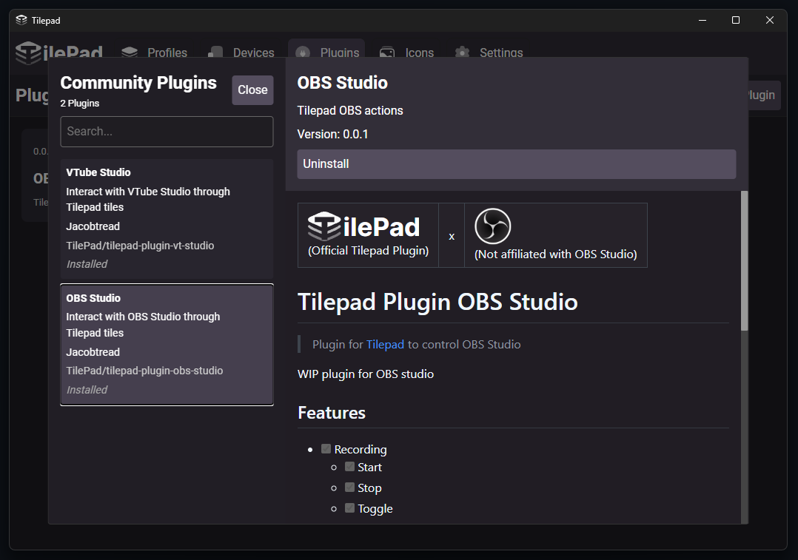

 

> ⚠️ WIP: TilePad is currently under active development. 

## 🚀 What is TilePad?

**TilePad** is a macropad software inspired by devices like the [Elgato Stream Deck](https://www.elgato.com/us/en/s/welcome-to-stream-deck) but using Android touchscreen mobile devices instead of requiring dedicated hardware. 

Written with [Svelte](https://svelte.dev/) & [Typescript](https://www.typescriptlang.org/) on the frontend using [Tauri v2](https://tauri.app/) and [Rust](https://www.rust-lang.org/) on the backend

## 🔌 Multiple devices

Connect multiple devices and assign them their own different profiles and folders

## 🧩 Plugin System

WebSocket powered plugin system that allows writing custom actions in the language of your choice to provide more advanced actions or custom integrations.

Plugins can provide "Inspectors" which are HTML pages that can communicate with the plugin itself allowing the creation of advanced customization UI for each action

## 🌍 Community Plugins Registry

There is a community plugins registry available where you can directly download plugins from GitHub. You can also manually side-load your own plugin bundles

## 🎨 Icon Packs

You can install collections of icons called icon packs to style your various tiles with icons. 

## 📦 Community Icon Packs Registry

There is a community icon packs registry available where you can directly download icon packs from GitHub. You can also manually side-load your own icon pack bundles. 

The community icon packs registry has a large number of automatically generated packs from [Tilepad Iconify Icon Packs](https://github.com/TilePad/tilepad-iconify-icon-packs) which contains all the icon packs present on [Iconify](https://icon-sets.iconify.design/)

## 🔒 Security

Although Tilepad is primarily designed for local use, it implements measures to ensure that all communication is handled securely where appropriate.

### 🔐 Secure Content

The following content is **securely transmitted** using **Diffie-Hellman key exchange over Curve25519**, with **XChaCha20-Poly1305** encryption over WebSocket:

- Device approval and connection processes  
- Triggering tile actions  
- Communication between **Inspector ↔ Device ↔ Plugin**  
- Communication between **Display ↔ Device ↔ Plugin**  
- Loading of tiles  

### 📄 Plain Text Content

The following content is **transmitted in plain text**:

- Icon pack icons
- Fonts
- Plugin assets
  - This includes iframes, displays, inspectors, and other plugin resources  
  - **Note:** Plugin-to-device communication is **not** included here and is transmitted securely  
- Plugin ↔ Inspector communication (local-only via loopback; does not leave the device)  

Due to current technical limitations, the above assets cannot be served over an encrypted socket:

- Tauri WebView does not accept self-signed certificates
- Loading plugin content via `srcDoc` breaks relative paths within iframes, as iframe resources rely on the original origin and file paths to serve relative resources such as plugin stylesheets

Because of these constraints, plugin assets must be loaded in plain text. However, these resources are **not considered sensitive**, and their exposure does **not pose a security risk**.

## Linux notes

To build on linux you must follow the [Enigo Runtime Dependencies](https://github.com/enigo-rs/enigo?tab=readme-ov-file#runtime-dependencies) instructions for your distribution (They are "Runtime Dependencies" but are also required while building otherwise linking will fail)